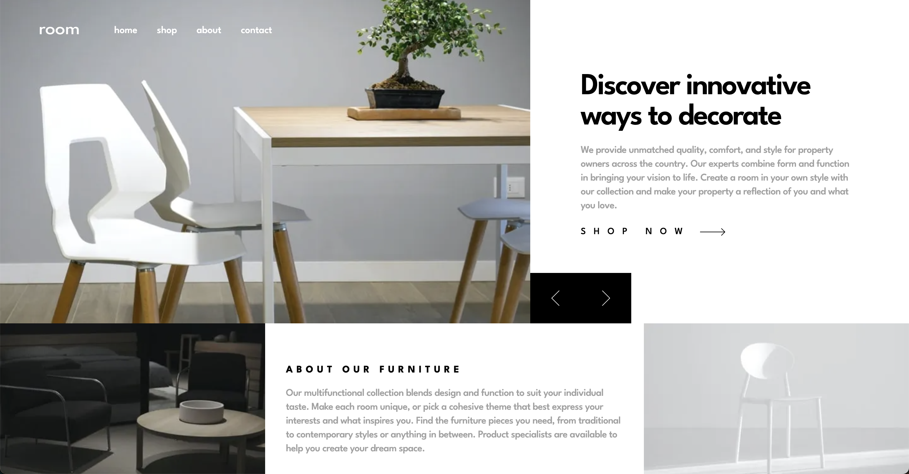

# Frontend Mentor - Room homepage solution

This is a solution to the [Room homepage challenge on Frontend Mentor](https://www.frontendmentor.io/challenges/room-homepage-BtdBY_ENq). Frontend Mentor challenges help you improve your coding skills by building realistic projects.

## Table of contents

- [Overview](#overview)
  - [The challenge](#the-challenge)
  - [Screenshot](#screenshot)
  - [Links](#links)
  - [Built with](#built-with)
  - [What I learned](#what-i-learned)
  - [Continued development](#continued-development)
  - [Useful resources](#useful-resources)
- [Author](#author)
- [Acknowledgments](#acknowledgments)

## Overview

Responsive and accessible Room homepage layout with optimized fonts and images.
React components:

- Animated slider
- Dialog
- Slider controls
- Dynamic article

### The challenge

Users should be able to:

- View the optimal layout for the site depending on their device's screen size
- See hover states for all interactive elements on the page
- Navigate the slider using either their mouse/trackpad or keyboard

### Screenshot



### Links

- Solution URL: [https://github.com/NikitaVologdin/React-Room-Home](https://github.com/NikitaVologdin/React-Room-Home)
- Live Site URL: [https://react-room-home.vercel.app/](https://react-room-home.vercel.app/)

### Built with

- Semantic HTML5 markup
- CSS custom properties
- Flexbox
- CSS Grid
- Mobile-first workflow
- Sass
- [React](https://reactjs.org/) - JS library
- [Framer Motion](https://motion.dev/) - Animation library

### What I learned

- When grid columns configured in percentage clumn-gaps are added in the grid.
- It is possible to setState during rerender. I used it for storing result of previous rerender.

```
  const [count, setCount] = useState(0);
  const [prevCount, setPrevCount] = useState(count);
  const [trend, setTrend] = useState(null);
  if (prevCount !== count) {
    setPrevCount(count);
    setTrend(count > prevCount ? 'increasing' : 'decreasing');
  }
```

- Framer motion AnimatePresence can track existence child element in the dom using key attribute on the element.
- Framer motion variants can be functions and receive a parameter from elements custom attribute.
- Animation shifting/bouncing on leaving dom can be resolved using `position:relative` on the parent and `position: absolute` on the leaving dom child.

### Useful resources

- [CSS tricks almanac](https://css-tricks.com/almanac/properties/g/grid-template-columns/) - This helped me to understand why i am having gaps in the grid.
- [Storing information from prev render](https://react.dev/reference/react/useState#storing-information-from-previous-renders) - React docs article about how to store prev render information.
- [How to declaratively animate a carousel](https://www.youtube.com/watch?v=aV2YJuxQ2vo) - Sam`s Selikoff great tutorial how to animate a carousel.

## Authors

- Website - [Nikita Vologdin](https://vologdin.eu/portfolio)
- Frontend Mentor - [@NikitaVologdin](https://www.frontendmentor.io/profile/NikitaVologdin)
